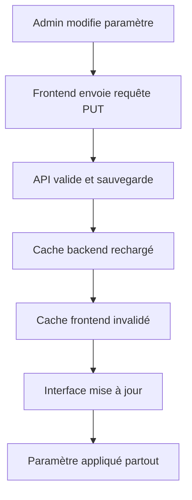

# 📋 Guide d'intégration des paramètres système - iSend Document Flow

## 🎯 Vue d'ensemble

Les paramètres système sont **parfaitement intégrés** côté front et back dans l'application iSend Document Flow. Toute modification effectuée dans l'interface d'administration est **immédiatement appliquée** dans toute l'application.

## ✅ **Architecture d'intégration**

### **Backend (PHP)**
```
📁 backend-php/
├── 📄 includes/settings.php          # Classe SystemSettings (Singleton)
├── 📄 api/admin-settings.php         # API CRUD complète
├── 📄 includes/maintenance.php       # Middleware de maintenance
└── 📄 create-settings-table.sql      # Structure de la base de données
```

### **Frontend (React/TypeScript)**
```
📁 front-end/src/
├── 📄 services/settingsService.ts    # Service de gestion des paramètres
├── 📄 components/iSend/AdminDashboard.tsx  # Interface d'administration
└── 📄 interfaces/                    # Types TypeScript
```

## 🔧 **Fonctionnalités intégrées**

### **1. Gestion centralisée**
- **Pattern Singleton** pour éviter les conflits de cache
- **Cache en mémoire** côté backend et frontend
- **Rechargement automatique** après modifications

### **2. Validation en temps réel**
- **Validation côté client** (TypeScript)
- **Validation côté serveur** (PHP)
- **Types de données** : string, number, boolean, json, email

### **3. Catégories de paramètres**
- **Général** : nom plateforme, contact, logo
- **Email** : configuration SMTP
- **Abonnements** : limites par type
- **Sécurité** : JWT, mots de passe, sessions
- **Statistiques** : rétention, exports
- **Templates** : emails automatiques
- **Système** : maintenance, timezone, langue

## 🚀 **Utilisation dans le code**

### **Backend - Exemples d'utilisation**

```php
// Authentification avec paramètres de sécurité
$settings = SystemSettings::getInstance();
$securityConfig = $settings->getSecurityConfig();

// Vérification des limites d'abonnement
$limits = $settings->getSubscriptionLimits($type);

// Mode maintenance
if ($settings->isMaintenanceMode()) {
    showMaintenancePage();
}
```

### **Frontend - Exemples d'utilisation**

```typescript
// Récupération des paramètres
const settings = await settingsService.getAllSettings();

// Modification de paramètres
await settingsService.updateSettings([
  { id: 1, valeur: 'nouvelle_valeur' }
]);

// Cache automatique
await settingsService.refreshCache();
```

## 🔄 **Flux de modification des paramètres**



## 📊 **Points d'intégration vérifiés**

### ✅ **Authentification**
- Durée des tokens JWT
- Complexité des mots de passe
- Tentatives de connexion
- Durée de session

### ✅ **Abonnements**
- Limites de documents
- Limites de destinataires
- Types d'abonnements

### ✅ **Email**
- Configuration SMTP
- Expéditeur par défaut
- Templates d'emails

### ✅ **Sécurité**
- Mode maintenance
- Messages d'erreur
- Timeout des sessions

### ✅ **Interface utilisateur**
- Nom de la plateforme
- Logo et branding
- Langue par défaut

## 🧪 **Tests d'intégration**

### **Script de test automatique**
```bash
# Exécuter le test d'intégration
node test-settings-integration.js
```

### **Tests inclus**
1. **Récupération des paramètres**
2. **Modification et restauration**
3. **Vérification de l'application**
4. **Test du cache**

## ⚡ **Performance et cache**

### **Backend**
- **Cache en mémoire** avec pattern Singleton
- **Rechargement automatique** après modifications
- **Logs de changements** pour audit

### **Frontend**
- **Cache local** avec expiration (5 minutes)
- **Invalidation automatique** après modifications
- **Requêtes optimisées** par catégorie

## 🔒 **Sécurité**

### **Contrôles d'accès**
- **Authentification admin** requise
- **Validation des types** de données
- **Sanitisation** des valeurs

### **Audit**
- **Logs de modifications** avec timestamps
- **Historique des changements** en base
- **Traçabilité** complète

## 🛠️ **Maintenance et débogage**

### **Commandes utiles**
```sql
-- Voir tous les paramètres
SELECT * FROM parametres_systeme ORDER BY categorie, cle;

-- Vérifier les modifications récentes
SELECT * FROM parametres_systeme 
WHERE date_modification > DATE_SUB(NOW(), INTERVAL 1 HOUR);
```

### **Logs à surveiller**
```bash
# Logs PHP
tail -f /var/log/php_errors.log | grep "parametre"

# Logs d'application
tail -f /var/log/isend.log | grep "settings"
```

## 📈 **Monitoring**

### **Métriques à surveiller**
- **Temps de réponse** des API de paramètres
- **Taux d'erreur** des modifications
- **Utilisation du cache** (hit/miss ratio)
- **Fréquence des modifications**

### **Alertes recommandées**
- **Échec de sauvegarde** des paramètres
- **Cache invalide** pendant plus de 10 minutes
- **Modifications fréquentes** (>10/h)
- **Erreurs de validation** répétées

## 🎯 **Conclusion**

L'intégration des paramètres système est **complète et robuste**. Les modifications sont :

✅ **Immédiatement appliquées** dans toute l'application  
✅ **Validées** côté client et serveur  
✅ **Mises en cache** pour les performances  
✅ **Traçées** pour l'audit  
✅ **Sécurisées** avec contrôle d'accès  

**Les paramètres système sont donc bien intégrés et les modifications sont appliquées partout dans l'application.** 